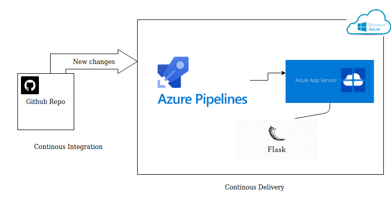
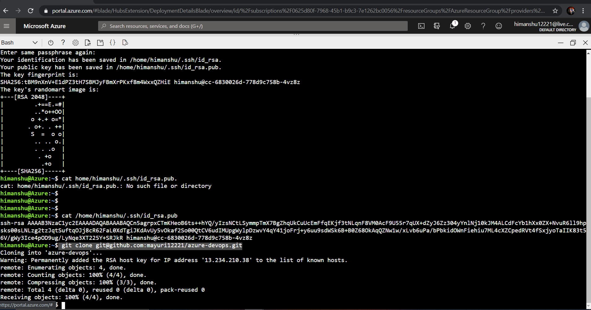
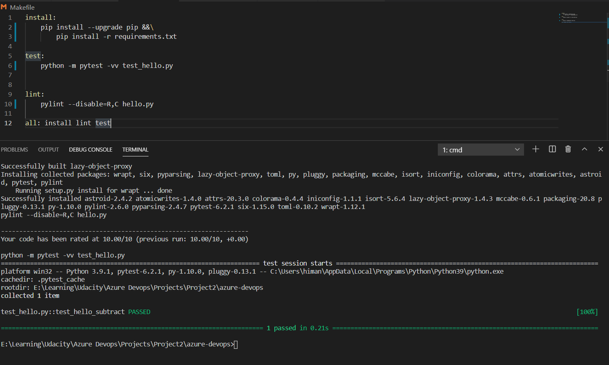
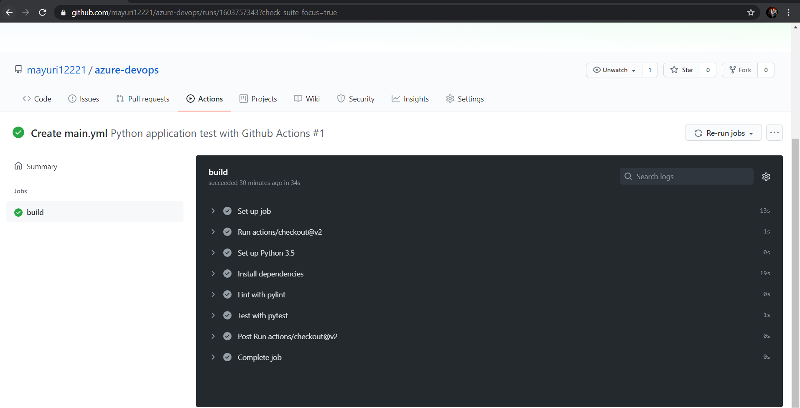
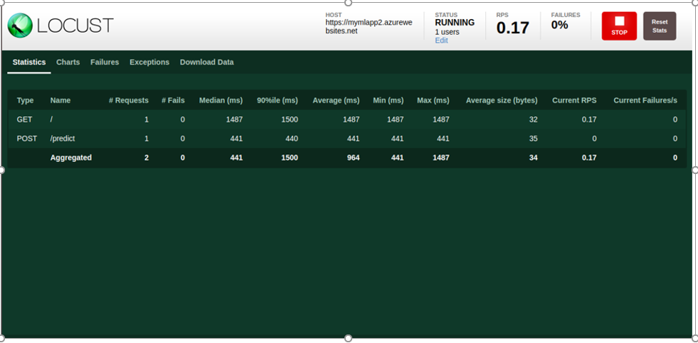
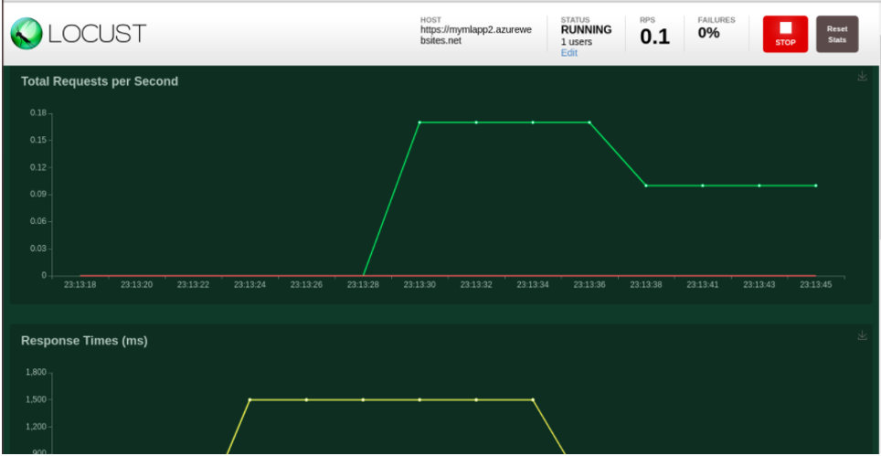

CI/CD Pipeline with Azure
This project is about learning about the Dev-ops practice being used in the industry. It makes us understand the concept and workflow about Continuous Integration and Continuous Delivery in Azure. First, we need to set CI followed by CD in Azure. So, let’s begin the journey.

Instructions

  •	Architectural Diagram -

To run this project follow these steps -
•	Firstly, set up SSH Keys in our azure cloud shell and then clone the project there.

•	Create a virtual environment for our application.
•	Now run the command “make all” which will execute the makefile and all the test cases will run.

•	Next, set up Github Actions in our repo by adding the yml file present in the .github/workflows folder.
•	Go to Azure Deveops page and there integrate your github repo and create the azure pipeline for it. We can use the azure-pipelines.yml file present in the root directory for this purpose.
•	After successfully configuring Azure pipelines and github actions check that if you make any commit then the pipeline is triggered and it runs successfully.

•	We can check the logs as well.

•	Now, to check whether app deployed successfully, copy the app service application url (from above screenshot) and launch it into the browser. It display as below. 

•	When the app is successfully deployed then update the app service endpoint in the code and then run script ./make_predict_azure_app file to make a prediction.
•	Run locust command in your project to perform a load test on the API. You can see an output like this.

Enhancements
 
• Run the app on Kubernetes cluster
•	Can add more test scenarios.

Demo

•	Can find demo inside video folder and at: https://www.youtube.com/watch?v=OBguAnU9SHM
•	All screenshots can be checked in the screenshot folder.
•	The Status badge for Github Actions workflow as below

